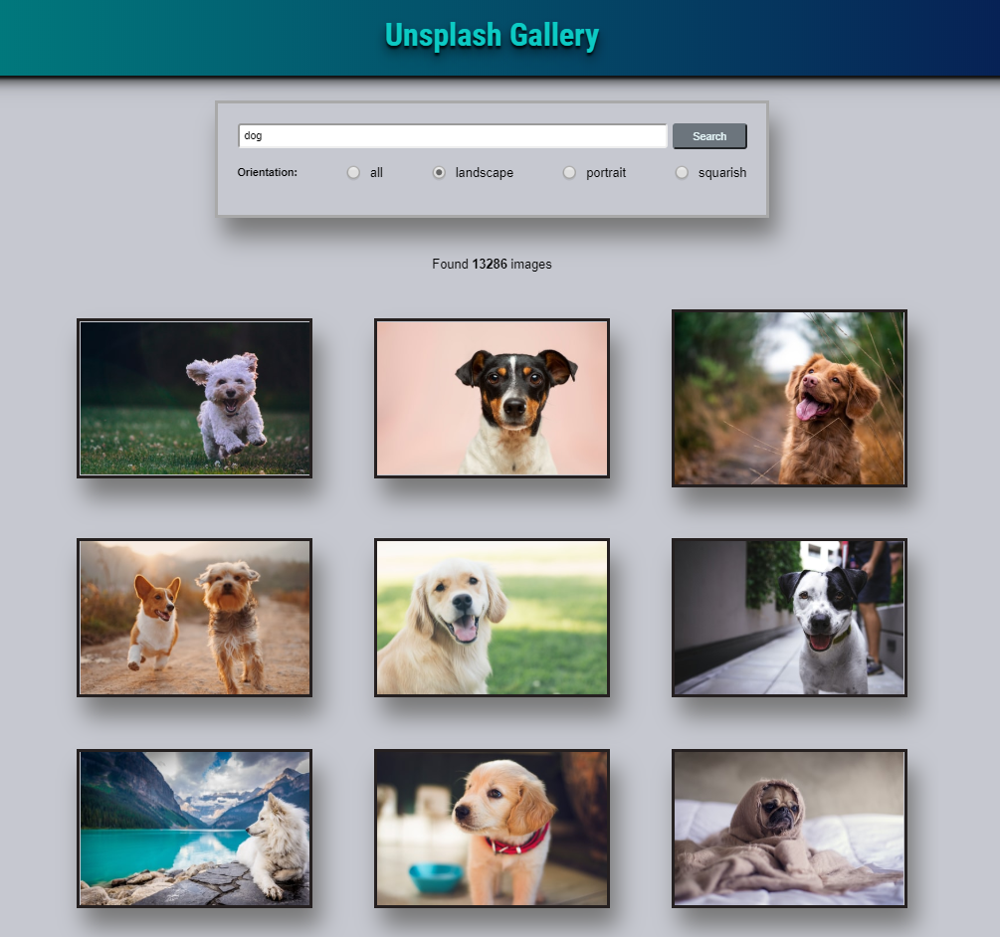
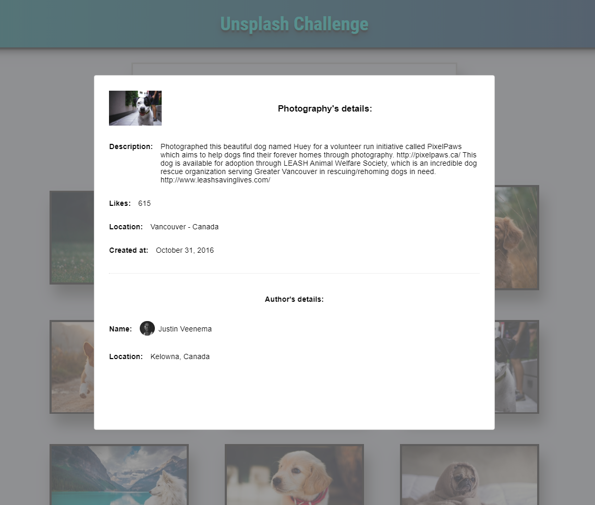

# Unsplash

Responsive Unsplash gallery app.

## Images

### Result

### Photo's details

## To run the project:

1. Clone this repo
2. Run `npm install`
3. Create a `.env` file in the project's folder and add the Unsplash's access key in the variable `REACT_APP_UNSPLASH_ACCESS_KEY`
4. Run `npm start`
